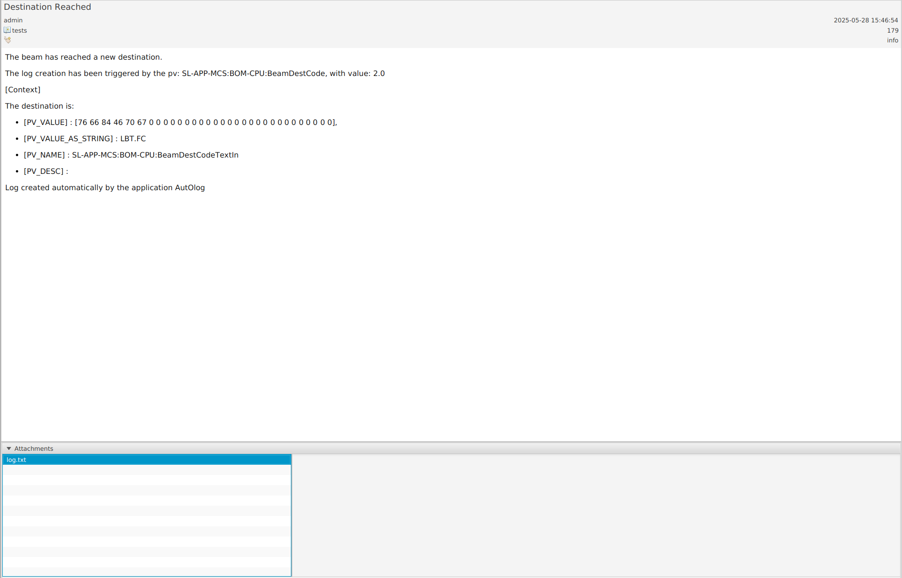
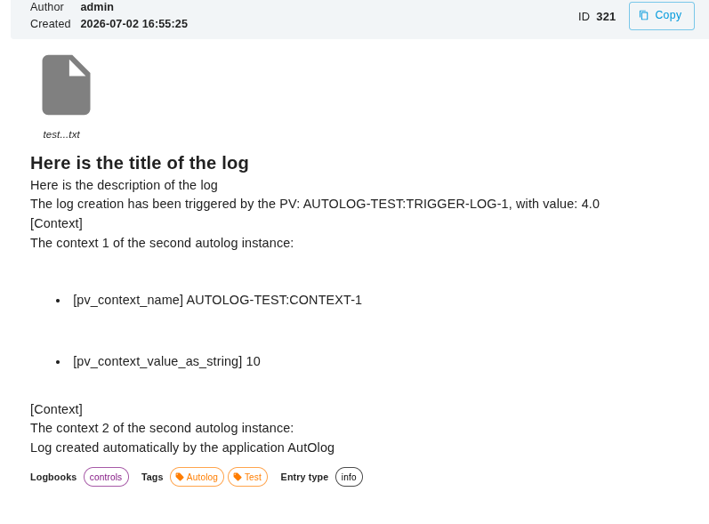

# AutOlog

## Presentation

A python tool to create automatically logs into Phoebus-Olog server, triggered by a PV value.

This tool needs to access the channel-access network where the EPICS IOC is running, and the API of the Phoebus-Olog server.

Check the package registry to get a binary that could be run with `procserv` as a a background programme.

## Installation

### Using Poetry

First, install Poetry.
Refer to the [Poetry](https://duckduckgo.com) for instructions.

To build the project, run:

``` bash
poetry install
poetry shell
```

Then you can call the script from anywhere

``` bash
autolog -h
```

### Using Binary

``` bash
poetry run build
```

It is using PyInstaller to create a binary in **dist**

``` bash
cd dist
autolog -h
```

## Usage

Usage example:

`autolog -c example/example.toml`

Help:

```bash
usage: autolog [-h] [-c] [-v {0,1,2,3,4,5}] config

A python tool to create automatically logs into Phoebus-Olog server, triggered by EPICS Process Variable.

positional arguments:
  config                The configuration file (TOML format) with required data.

optional arguments:
  -h, --help            show this help message and exit
  -c, --credentials     Ask user for username, password and api_url
  -v {0,1,2,3,4,5}, --verbosity {0,1,2,3,4,5}
                        decrease output verbosity. 5 (Critical), 4 (Error), 3 (Warning, default), 2 (Info), 1 (Debug)
```

## TOML file

See `example/example.toml` for complete example of a configuration file.

The result in Phoebus-Olog client for autolog instance 1:


The result in Phoebus-Olog client for autolog instance 2:


## Tests

`poetry run pytest`

unit test, for example to test log_content.py:
`poetry run pytest -m log_content`
